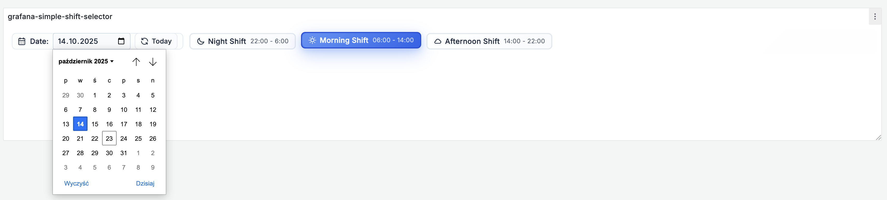
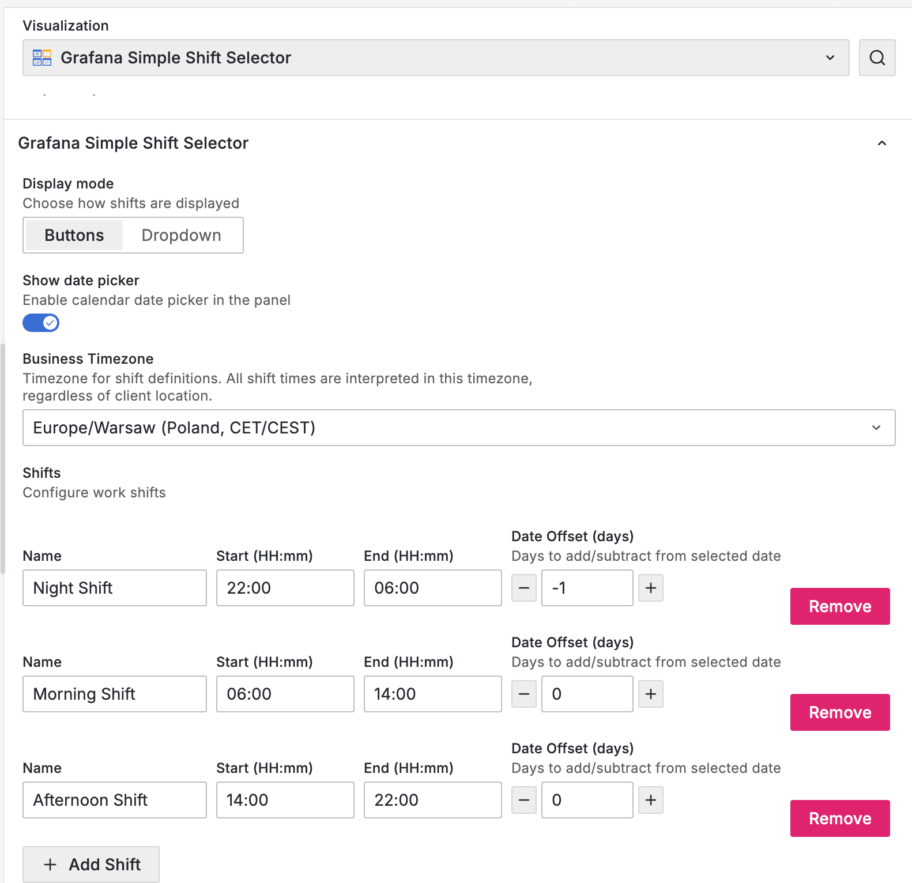
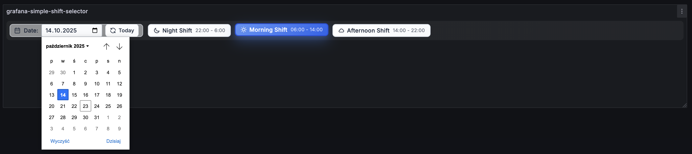
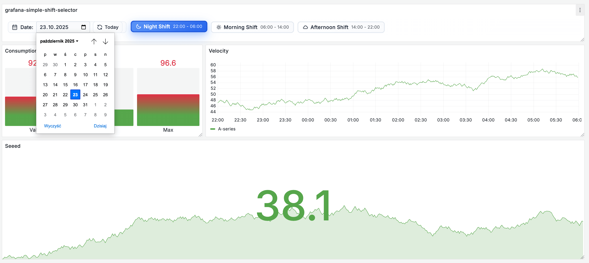

# Simple Shift Selector Panel


A Grafana panel plugin for quickly changing dashboard time ranges by selecting predefined work shifts. Perfect for operational dashboards with day/night shifts, manufacturing operations, healthcare rotations, and logistics tracking.



## ✨ Features

- **Predefined Shift Selection**: Configure custom work shifts (Morning, Afternoon, Night, etc.)
- **Timezone Support**: Full timezone handling with automatic DST adjustments
- **Two Display Modes**: Choose between button group or dropdown selector
- **Date Picker**: Optional calendar for viewing historical shift data
- **Overnight Shifts**: Support for shifts spanning midnight (e.g., 22:00-06:00)
- **Automatic Updates**: Dashboard time range updates automatically on shift selection
- **Dark Theme**: Full support for Grafana's dark and light themes
- **Auto-Reset**: Shift selection clears when date changes (prevents stale data)

## 🎯 Use Cases

### Manufacturing
Track production metrics across 8-hour shifts (06:00-14:00, 14:00-22:00, 22:00-06:00). Monitor equipment efficiency, downtime, and output for each shift with a single click.

### Healthcare
Monitor patient care during nurse rotations and shift changes. Quickly view vital statistics, medication administration, and patient outcomes by shift.

### Logistics
View delivery performance and warehouse operations by shift. Track shipments processed, loading dock efficiency, and staff productivity across different work periods.

### Operations
Quick access to current shift data for operational dashboards. Perfect for 24/7 operations centers, customer support teams, and facility management.

## 📦 Installation

### From Grafana Catalog (After Approval)
1. Go to Grafana → Configuration → Plugins
2. Search for "Simple Shift Selector"
3. Click Install

### From GitHub Releases
1. Download the latest release ZIP from [GitHub Releases](https://github.com/monyskow/monyskow-simpleshiftselector-panel/releases)
2. Extract to your Grafana plugins directory (typically `/var/lib/grafana/plugins/`)
3. Restart Grafana server
4. Verify plugin loaded in Grafana logs

### Build from Source
```bash
git clone https://github.com/monyskow/monyskow-simpleshiftselector-panel.git
cd monyskow-simpleshiftselector-panel
npm install
npm run build
```

## ⚙️ Configuration

### Adding Shifts
1. Add the Simple Shift Selector panel to your dashboard
2. Open the panel editor (click panel title → Edit)
3. In the panel options, click **"Add Shift"**
4. Configure shift parameters:
   - **Name**: Display name for the shift (e.g., "Morning", "Day Shift", "Night")
   - **Start Time**: Shift start time in 24-hour format (e.g., `06:00`)
   - **End Time**: Shift end time in 24-hour format (e.g., `14:00`)
   - **Date Offset**: Number of days to add to the end time (0 for same day, 1 for next day)

### Display Options
- **Display Mode**: Choose between "Buttons" (visual button group) or "Dropdown" (compact selector)
- **Show Date Picker**: Enable or disable the date picker for historical data viewing
- **Timezone**: Select the timezone for shift time calculations (defaults to browser timezone)

### Overnight Shifts Example
For a night shift from 22:00 to 06:00 the next morning:
- **Name**: `Night`
- **Start**: `22:00`
- **End**: `06:00`
- **Date Offset**: `1` (indicates end time is the next day)

When selected, this will set the dashboard time range from 22:00 of the selected date to 06:00 of the following date.

### Example Configuration
```json
{
  "shifts": [
    {
      "name": "Morning",
      "start": "06:00",
      "end": "14:00",
      "dateOffset": 0
    },
    {
      "name": "Afternoon",
      "start": "14:00",
      "end": "22:00",
      "dateOffset": 0
    },
    {
      "name": "Night",
      "start": "22:00",
      "end": "06:00",
      "dateOffset": 1
    }
  ],
  "displayMode": "buttons",
  "showDatePicker": true,
  "timezone": "Europe/Warsaw"
}
```

## 📸 Screenshots

### Main Panel View

*Button group display mode with three shifts configured*

### Configuration Editor

*Panel editor showing shift configuration options*

### Dark Theme

*Full dark theme support for night operations*

### Real-World Example

*Example operational dashboard with shift selector*

## 🔧 Requirements

- **Grafana**: 10.4.0 or later
- **Browsers**: Chrome, Firefox, Safari, Edge (modern versions with ES6 support)

## 🧪 Testing

This plugin is thoroughly tested with comprehensive test coverage:

- **68 unit tests** using Jest and React Testing Library
- **32 end-to-end tests** using Playwright and @grafana/plugin-e2e
- **93.1% code coverage** across statements, branches, and functions
- Tested across multiple Grafana versions (10.4+, 11.0+, latest)
- Comprehensive timezone handling and DST transition tests
- Edge case testing for overnight shifts and date boundaries

### Running Tests

```bash
# Install dependencies
npm install

# Run unit tests
npm run test:ci

# Run unit tests with coverage
npm run test:coverage

# Run E2E tests (requires Grafana running)
npm run server          # In one terminal
npm run e2e             # In another terminal

# Run type checking
npm run typecheck

# Run linting
npm run lint
```

See [TESTING.md](TESTING.md) for detailed testing documentation and best practices.

## 🤝 Contributing

Contributions are welcome! Whether it's bug reports, feature requests, or code contributions, we appreciate your help in making this plugin better.

Please see [CONTRIBUTING.md](CONTRIBUTING.md) for detailed guidelines on:
- Setting up your development environment
- Code style and standards
- Testing requirements
- Pull request process

### Quick Start for Contributors

```bash
# Fork and clone the repository
git clone https://github.com/YOUR_USERNAME/monyskow-simpleshiftselector-panel.git
cd monyskow-simpleshiftselector-panel

# Install dependencies
npm install

# Start development build (watches for changes)
npm run dev

# Start Grafana (in a separate terminal)
npm run server

# Open http://localhost:3000 (admin/admin)
```

## 📝 License

Apache License 2.0 - see [LICENSE](LICENSE) file for details.

Copyright (c) 2025 monyskow

## 🐛 Support & Community

### Bug Reports
Found a bug? Please report it on [GitHub Issues](https://github.com/monyskow/monyskow-simpleshiftselector-panel/issues) with:
- Clear description of the issue
- Steps to reproduce
- Grafana and plugin versions
- Browser and OS information
- Screenshots or console errors if applicable

### Questions & Discussions
Have questions or want to discuss features? Use [GitHub Discussions](https://github.com/monyskow/monyskow-simpleshiftselector-panel/discussions)

### Contact
- **GitHub**: [@monyskow](https://github.com/monyskow)
- **Sponsor**: [GitHub Sponsors](https://github.com/sponsors/monyskow)

## 📚 Additional Documentation

- [CHANGELOG.md](CHANGELOG.md) - Version history and release notes
- [CONTRIBUTING.md](CONTRIBUTING.md) - Contribution guidelines and development setup
- [TESTING.md](TESTING.md) - Testing documentation and best practices
- [TEST_SUMMARY.md](TEST_SUMMARY.md) - Test coverage summary

## 🙏 Acknowledgments

This plugin was built using:
- [@grafana/create-plugin](https://www.npmjs.com/package/@grafana/create-plugin) - Official Grafana plugin scaffolding tool
- [dayjs](https://day.js.org/) - Lightweight date/time library with timezone support
- [Jest](https://jestjs.io/) and [React Testing Library](https://testing-library.com/react) - Testing frameworks
- [Playwright](https://playwright.dev/) - End-to-end testing framework

## 🌟 Features Coming Soon

- Custom shift templates library
- Shift handover notes integration
- Multiple timezone display
- Shift overlap warnings
- Export shift schedules

---

Made with ❤️ by [monyskow](https://github.com/monyskow)
